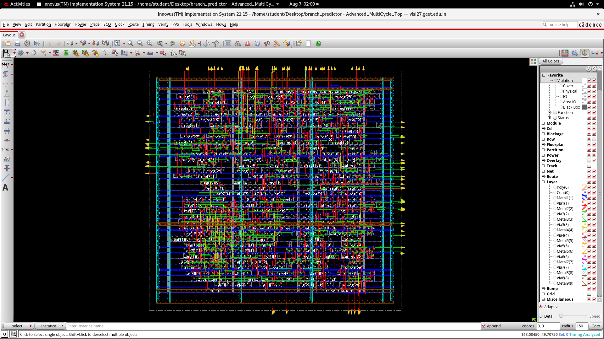
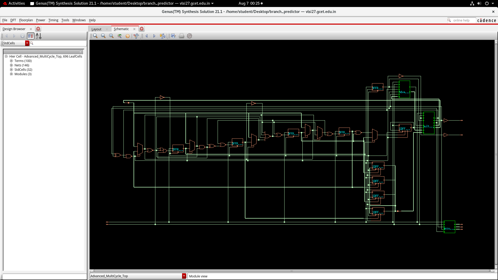
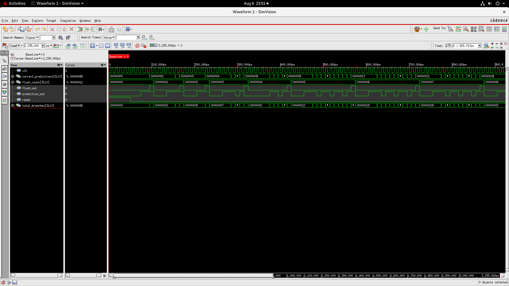
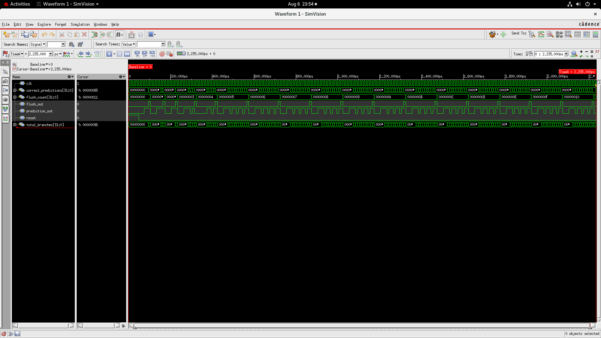
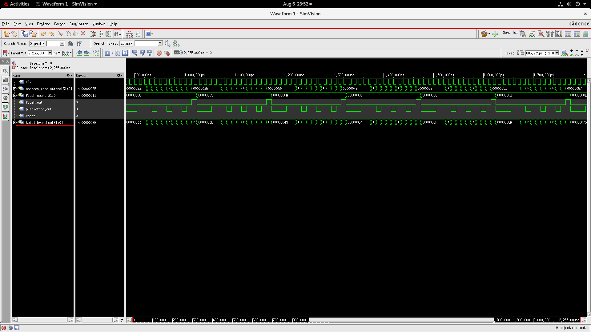
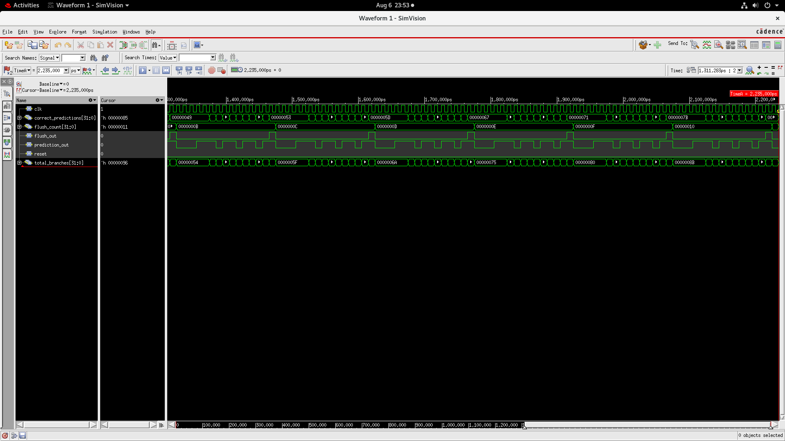

# Advanced Multi-Cycle Branch Predictor — RTL to GDSII

A 4-bit GHR (Global History Register) two-level adaptive branch predictor with a 3-stage multi-cycle pipeline, taken through a complete **RTL-to-GDSII physical design flow** using the Cadence ASIC toolchain (Genus + Innovus) on a 90nm process.


---

## Overview

| | |
|---|---|
| **Architecture** | 4-bit global history register indexing a 16-entry, 2-bit saturating-counter prediction table (PHT), integrated into a 3-stage multi-cycle pipeline with branch misprediction flush/recovery logic |
| **Verification** | Functional simulation across 150 resolved branches, achieving **88% prediction accuracy** (133 correct / 17 flushes) |
| **Physical Design** | Full RTL-to-GDSII flow — synthesis, floorplanning, power planning, placement, clock tree synthesis, routing, and static timing analysis — completed with clean timing closure |

---

## Final Layout

<p align="center">
  
</p>
<p align="center"><em>Fully routed layout in Cadence Innovus — power rings/stripes (Metal8/Metal9), standard cell rows, and detailed routing.</em></p>

## Synthesized Schematic

<p align="center">
  
</p>
<p align="center"><em>Gate-level schematic generated by Cadence Genus post-synthesis.</em></p>

## Functional Simulation Waveforms

<p align="center">
  <br>
  <em>Early simulation cycles — clk, prediction_out, flush_out, total_branches tracked in SimVision.</em>
</p>

<p align="center">
  <br>
  <em>Final simulation state — 150 branches resolved, converging to 88% prediction accuracy.</em>
</p>

<details>
<summary>More waveform captures</summary>
<p align="center">
  <br>
  
</p>
</details>

---

## Design Modules

| Module | Description |
|---|---|
| `Advanced_MultiCycle_Top` | Top-level module wiring all submodules together |
| `Advanced_Predictor` | 4-bit GHR + 16-entry 2-bit saturating counter prediction table |
| `multi_cycle_pipeline` | 3-stage shift-register pipeline carrying prediction/actual/history/index |
| `flush_controller` | Detects mispredictions and computes flush + recovery index |
| `branch_pattern_generator` | Generates a fixed 11-bit repeating branch pattern for testing |
| `accuracy_counter` | Tracks total branches, correct predictions, and flush count |

---

## Results

### Functional Simulation

| Metric | Value |
|---|---|
| Total Branches Resolved | 150 |
| Correct Predictions | 133 |
| Pipeline Flushes | 17 |
| **Prediction Accuracy** | **88%** |

### Synthesis (Cadence Genus, 90nm, slow corner)

| Metric | Value |
|---|---|
| Total Cell Count | 696 |
| Total Area | 6497.23 µm² |
| Total Power | 0.729 mW |
| Worst Setup Slack | 6508 ps (MET) |

Full reports: [`area_report.txt`](area_report.txt) · [`power_report.txt`](power_report.txt) · [`timing_report.txt`](timing_report.txt)

### Physical Design (Cadence Innovus)

- Power planning: rings (Metal9 top/bottom, Metal8 left/right) + stripes (Metal8 vertical, Metal9 horizontal), width/spacing 0.5 µm
- Standard placement, CTS via `ccopt_design`, detailed routing
- On-Chip Variation (OCV) analysis enabled for post-route signoff: `setAnalysisMode -analysisType onChipVariation -cppr both`
- Post-route optimization (`optDesign`) completed with **70.5% placement density**, no errors

---

## Key Design Fixes Applied

During synthesis, two RTL constructs required correction for tool compatibility (see inline comments in [`Advanced_MultiCycle_Top.v`](Advanced_MultiCycle_Top.v)):

1. **`multi_cycle_pipeline` reset logic** — an async-reset-sensitive always block originally combined `if (reset || flush)`, mixing a sensitivity-list signal with a non-listed one in the same branch. This caused synthesis elaboration errors (`CDFG-364` in Genus). Fixed by splitting into separate `if (reset) ... else if (flush) ...` branches.
2. **`pattern1` initializer** — an inline register initializer (`reg [10:0] pattern1 = ...`) was silently ignored during synthesis (`VLOGPT-37` in Genus), meaning the register would power up undefined in real silicon. Fixed by converting `pattern1` to a `localparam`, since its value is constant at runtime.

Full writeup of challenges and resolutions: [`project_report.pdf`](project_report.pdf)

---

## Tools Used

- **Cadence Genus** — RTL synthesis
- **Cadence Innovus** — floorplanning, power planning, placement, CTS, routing, timing signoff
- **Cadence NC-Launch / SimVision** — functional simulation and waveform analysis
- **Process:** 90nm (GSCLib/GPDK teaching PDK)

---

## How to Simulate

```bash
# Using Icarus Verilog (open-source alternative for quick functional checks)
iverilog -o sim_out rtl/Advanced_MultiCycle_Top.v testbench/tb_Advanced_MultiCycle_Top.v
vvp sim_out
```

Expected output:
```
Total Branches Resolved :        150
Correct Predictions     :        133
Total Pipeline Flushes  :         17
Overall Accuracy : 88%
```

---

## Documentation

- 📄 [Full Project Report](project_report.pdf) — technologies used, achievements, challenges faced, and future improvements
- 📄 [Flow Guide](flow_guide.pdf) — step-by-step RTL-to-GDSII flow reference (Cadence Genus + Innovus)
